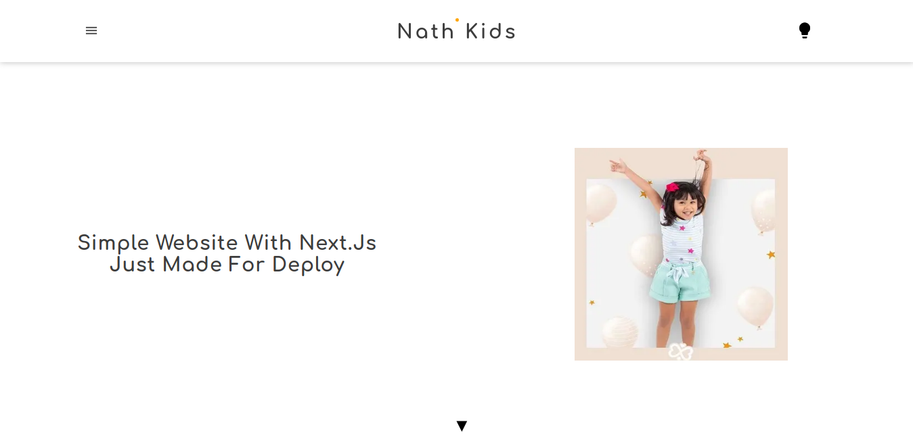
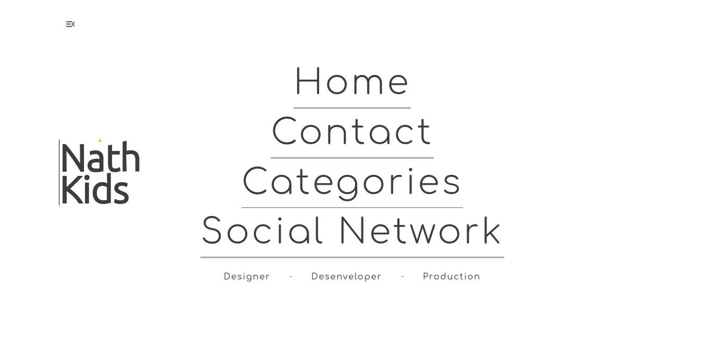
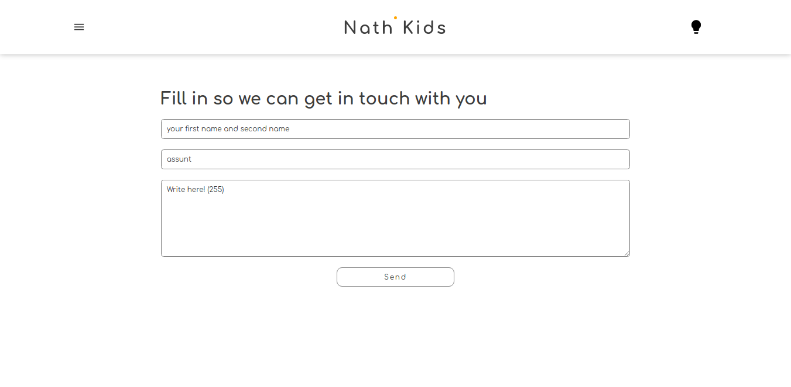

## NathKids

#### Projeto feito em nextjs para treino, aplicação bem completinha... 

### Tecnologias usadas

<ul>
  <li><a href='https://nodejs.org/en/'>Node</a></li>
  <li><a href='https://nextjs.org/'>Nextjs</a></li>
  <li><a href='https://www.npmjs.com/package/nookies'>Nookies</a></li>
  <li><a href='https://prismic.io/'>Prismic</a></li>
  <li><a href='https://www.typescriptlang.org/'>typescript</a></li>
  <li><a href='https://styled-components.com/'>Styled-components</a></li>
</ul>

### Aplicação com essas rotas:

<ul>
  <li>/categories</li>
  <li>/categories/vestidos</li>
  <li>/categories/conjuntos</li>
  <li>/products/[slug]</li>
  <li>/contact</li>
  <li>/credits</li>
  <li>/social</li>

</ul>

## Algumas prints da aplicação

##### criado por Higor Allan como um projeto para treinar sua evolução no front-end.